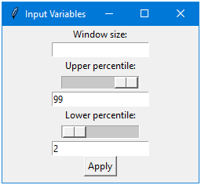

# Data Cleaning Tool

This code provides a data cleaning tool for a given data set in a .csv file format. The tool can clean the data by calculating moving average and removing outliers based on specified lower and upper percentiles. The tool also provides a graphical representation of the cleaned data for visualization purposes.

## Purpose

This code was created with the purpose of replacing a slower excel based method for processing data. The goal was to provide a faster and more efficient solution that can handle larger amounts of data in a timely manner.
# Functionality 

The tool can be run by executing the file 'DataCleaningTool.py'. Upon execution, the user will be prompted with a Tkinter GUI that asks for the following inputs:

- Window size: This is the number of data points to be used for calculating the moving average. This input should be a integer  between one and the maximum length of the dataset.
- Upper percentile: This is the upper bound percentile that will be used to remove outliers from the data set. This value should be a float between zero and one hundred.
- Lower percentile: This is the lower bound percentile that will be used to remove outliers from the data set. This value should be a float between zero and one hundred.

Once the inputs have been specified, the user will be asked to select the .csv file containing the data set. The tool will then process the data and provide a graphical representation of the cleaned data.

### User Interface

## Challenges/Shortcomings 

The challenge in handling multiple datasets/circuit breakers, from a single input file is that the user-defined variables are applied to all datasets indiscriminately. This creates a problem as a set of parameters that works well for one dataset may not necessarily be suitable for others. To address this, two possible solutions are to either isolate each dataset independently or categorize them into groups based on their similar profiles.
## Further Development 
### Modularity of code
During the development of the primary code, a modular approach was taken to ensure ease of further development. For instance, the 'moving_average' function was designed to be easily interchangeable with an exponential moving average, showcasing the flexibility and modularity of the code. The modular design of the codebase allows for easy understanding, modification, and extension of the code, reducing code duplication and ensuring consistency. This saves time for future developers and allows them to focus on building new features and improving overall functionality

### Improvements
- Multiple Iterations: The next feature to be developed is the ability for the user to specify the number of iterations the data cleaning function will perform. For example, if the user inputs '3', the function will clean the data three times, enhancing its cleaning ability. 
- Saving files: To further improve the usability of the application, a new feature that can be implemented is the ability to save output plots directly to file.
- Error detection and handling: A data cleaning program could include features that detect and handle errors in the data, such as missing values, inconsistent formatting, or incorrect data types. This could help ensure that the data is as accurate and complete as possible.
- Integration with other tools and platforms: A data cleaning program could be designed to integrate with other tools and platforms, such as data visualization software or machine learning frameworks. This could help streamline the data cleaning process and enable users to more easily analyze and draw insights from the data.
- Version control: A data cleaning program could include version control features, such as the ability to save and compare different versions of the data or track changes over time. This could help ensure that the data is as up-to-date and accurate as possible, and enable users to easily revert to previous versions if needed.
- Automated testing: A data cleaning program could include automated testing features that verify the accuracy and completeness of the cleaned data, based on user-defined criteria or statistical analysis. This could help ensure that the data is as reliable as possible and reduce the risk of errors or discrepancies.

# Installation

Required Modules, most of which should already be installed in the standard installation of python
-  [pandas](http://pandas.pydata.org/) (used for its dataframe object) 
-  [numpy](http://numpy.org) (general mathematical functions)
-  [matpotlib](http://matplotlib.org/) (used to plot the end result) 
-  [tkinter](https://docs.python.org/3/library/tkinter.html#module-tkinter) (used to create pop out windows for user inputs)
-  [statistics](https://docs.python.org/3/library/statistics.html) (used for its normal distribution function)

# Code Structure/Functions
The code consists of the following functions:

- get_variables: This function creates the Tkinter GUI for inputting the window size, upper percentile, and lower percentile.
- importing: This function allows the user to select the .csv file containing the data set.
- moving_average: This function calculates the moving average of the data set using a sliding window approach. 
- cleaning_data: This function removes outliers from the data set based on the specified upper and lower percentiles and creates a graphical representation of the cleaned data.

(Although 'moving_average' is inclued within the code this is not used or recomended to be used. This functions purely is a direct representation of the 'moving average' from the excel file, however this method is slow inacuate and lacking justification for its use)
## Moving Average

The use of an Exponentially Weighted Moving Average (EWMA) was selected over the traditional Simple Moving Average (SMA) method in the excel analysis due to the characteristics of the data set being analyzed. The data set consists of a large number of data points, typically greater than 100,000, with a close time interval between each data point, as short as five minutes. Given these characteristics, EWMA provides a more effective representation of the time-series data by quickly responding to any changes in the data and accurately capturing short-term trends. The selection of EWMA over SMA reflects a careful consideration of the characteristics of the data set and the goals of the analysis.

There are several reasons why EWMA may be a better choice than other moving average methods:

- Responsiveness to recent changes: EWMA gives more weight to the most recent data points, which makes it more responsive to changes in the data. This is particularly important when analyzing time-series data, as recent data points often carry more information about the underlying trend.
- Ability to capture short-term trends: By assigning more weight to recent data points, EWMA is able to capture short-term trends that may be present in the data. This can be particularly useful when analyzing data with significant fluctuations or changes.
- Robustness to outliers: EWMA has a built-in mechanism for reducing the impact of outliers on the overall trend, which makes it a more robust method for analyzing noisy data.
- Computational efficiency: Unlike other moving average methods, such as simple moving average (SMA) or weighted moving average (WMA), EWMA does not require the calculation of all previous data points to determine the current average. This makes it a more computationally efficient method for analyzing large data sets.

In summary, EWMA is a flexible and effective method for analyzing time-series data, particularly when dealing with large data sets with a high frequency of data points. By giving more weight to recent data points and providing a more responsive representation of the trend, EWMA can help to identify important patterns and trends in the data that may be missed by other methods.

## Output Comparison
To assess the performance of both methods (Excel and Python), a test was conducted using a moving window of 70,000. This was designed to push the curve to its limits and make it easier to identify the difference in results. The results, as illustrated in the following figures, show that the Python implementation effectively captures the trend of the curve with a much greater accuracy than Excel. Additionally, Excel continues to calculate the average even when no values are available, which is not only useless but also inconsistent with proper data cleaning practices. 
### Excel with a window size of 70,000

### Python with a window size of 70,000

## Conclusion 

This data cleaning tool provides a convenient way to clean data sets and visualize the results. The tool can be modified and customized to fit different data cleaning requirements by changing the code as necessary.
